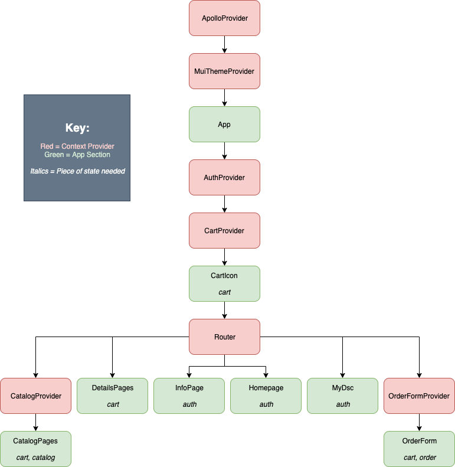

# Dicty Stock Center

## Table of Contents

- [Readme](/README.md)
- Redux
  - [Shape of the state](./redux/state.md)
- [Navigational flow](./navigational-flow.md)
- [Component wireframe](./component-wireframe.md)
- [Authentication/authorization](./auth.md)

The DSC app is in the process of being converted from Redux to Context/Hooks for
state management. Currently there are four pieces of state still in Redux
(`auth`, `page`, `footer`, `navbar`), but the end goal is to convert these into
their own context providers. See this tree diagram:

